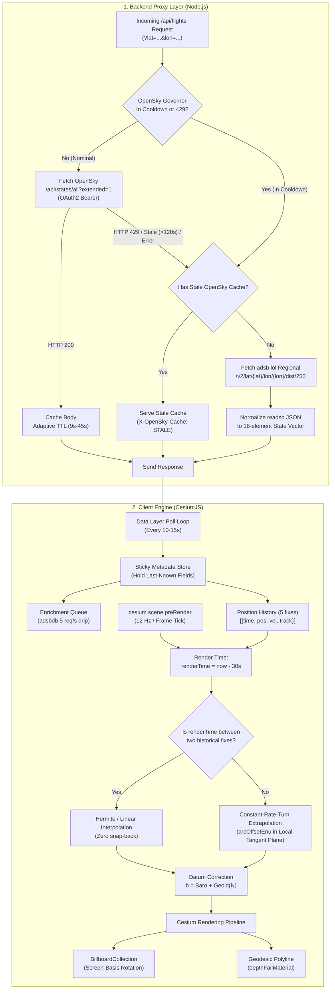

# Flight Tracking & 3D Globe Rendering: Implementation & Recreation Guide

> **Note for AI Implementation Agents:** This document is an all-inclusive specification and code blueprint. Follow the **Step-by-Step Implementation Instructions** in Section 5 to implement this system directly into the target repository.

---

## 1. Why God's Eye View Feels So Much Smoother

Most flight tracking projects struggle with three common visual problems:
1. **The Rubber-Banding / Snapping Problem:** When interpolating or extrapolating in real-time, network jitter and variable API polling intervals cause planes to overshoot into the future, and then snap backward when a new transponder fix arrives.
2. **The Terrain / Building Burial Problem:** Naively passing barometric altitude to Cesium buries planes in elevated airports (e.g. Denver or Austin) because Cesium uses the **WGS84 Ellipsoid**, while aircraft report **Orthometric / Mean Sea Level (MSL)** altitude.
3. **The Billboards-Facing-the-Camera Distortion:** When billboards are rotated in 3D, pitching or orbiting the camera distorts the icon's heading.

**God's Eye View solves these through five engineering pillars:**
1. **30-Second Render-Behind Playback:** Renders at `now - 30s`. Because OpenSky polls arrive every 10–25 seconds, the renderer almost always interpolates between two known fixes ($A$ and $B$) rather than guessing the future.
2. **Constant-Rate-Turn (CRT) ENU Arc Math:** When extrapolation is necessary (feed dropouts or fresh acquisitions), motion is integrated as a circular arc in the local East-North-Up tangent plane based on turn rate ($\omega$).
3. **Datum Correction ($h = H + N$):** Corrects aviation barometric altitude ($H$) by adding local EGM96 Geoid undulation ($N$).
4. **Resilient Multi-Tier Proxy with Credit Governor:** Automatically switches from OpenSky worldwide snapshots to adsb.lol regional snapshots on rate limits or outages, while caching and serving stale data instead of dropping frames.
5. **GPU Batching & Screen-Basis Projection:** Renders 5,000+ aircraft in **1 draw call** via `BillboardCollection`, computing course rotation directly on the camera's Right/Up basis vectors.

---

## 2. Architecture & Data Flow



---

## 3. Production Code Modules

### Module 1: Backend Flight Proxy (`flightProxy.mjs`)
*Handles OpenSky OAuth2 token negotiation, credit governor, adaptive TTL, fail-soft caching, and adsb.lol regional fallback.*

```javascript
// flightProxy.mjs - Standalone Node/Express/Vite middleware
import { URL } from 'url';

const OPENSKY_TOKEN_URL = 'https://auth.opensky-network.org/auth/realms/opensky-network/protocol/openid-connect/token';
const OPENSKY_API_URL = 'https://opensky-network.org/api/states/all?extended=1';
const ADSBLOL_POINT_URL = 'https://api.adsb.lol/v2/lat';

let openskyToken = null;
let openskyTokenExpiry = 0;
let openskyTokenPromise = null;

let cacheBody = null;
let cacheTime = 0;
let cooldownUntil = 0;
let currentTtlMs = 9000;

// OAuth2 Token Refresher with Request Coalescing
async function getOpenSkyToken(clientId, clientSecret) {
  if (!clientId || !clientSecret) return null;
  const now = Date.now();
  if (openskyToken && now < openskyTokenExpiry - 60000) return openskyToken;
  if (openskyTokenPromise) return openskyTokenPromise;

  openskyTokenPromise = (async () => {
    try {
      const res = await fetch(OPENSKY_TOKEN_URL, {
        method: 'POST',
        headers: { 'Content-Type': 'application/x-www-form-urlencoded' },
        body: `grant_type=client_credentials&client_id=${encodeURIComponent(clientId)}&client_secret=${encodeURIComponent(clientSecret)}`,
      });
      const data = await res.json();
      if (!res.ok || !data.access_token) return null;
      openskyToken = data.access_token;
      openskyTokenExpiry = Date.now() + (Number(data.expires_in) || 1800) * 1000;
      return openskyToken;
    } catch {
      return null;
    } finally {
      openskyTokenPromise = null;
    }
  })();
  return openskyTokenPromise;
}

// Convert adsb.lol readsb JSON into OpenSky's 18-element state vector array
export function normalizeAdsbLolToOpenSky(payload) {
  const nowSeconds = Math.floor((payload?.now || Date.now()) / 1000);
  const KNOT_TO_MPS = 0.514444;
  const FOOT_TO_M = 0.3048;

  const states = (payload?.ac || []).map((ac) => {
    if (!ac.hex || ac.lat == null || ac.lon == null) return null;
    const onGround = ac.alt_baro === 'ground';
    const baroM = onGround ? null : (Number.isFinite(ac.alt_baro) ? ac.alt_baro * FOOT_TO_M : null);
    const geomM = Number.isFinite(ac.alt_geom) ? ac.alt_geom * FOOT_TO_M : null;
    const speedMps = Number.isFinite(ac.gs) ? ac.gs * KNOT_TO_MPS : null;

    return [
      String(ac.hex).toLowerCase(),               // [0] icao24
      String(ac.flight || ac.r || '').trim(),    // [1] callsign
      null,                                       // [2] origin_country
      nowSeconds - (ac.seen_pos || 0),           // [3] time_position
      nowSeconds - (ac.seen || 0),               // [4] last_contact
      ac.lon,                                     // [5] longitude
      ac.lat,                                     // [6] latitude
      baroM,                                      // [7] baro_altitude
      onGround,                                   // [8] on_ground
      speedMps,                                   // [9] velocity (m/s)
      ac.track ?? null,                           // [10] true_track (deg)
      Number.isFinite(ac.baro_rate) ? ac.baro_rate * 0.00508 : null, // [11] vertical_rate
      null,                                       // [12] sensors
      geomM,                                      // [13] geo_altitude (m, WGS84)
      ac.squawk || null,                          // [14] squawk
      ac.spi === 1,                               // [15] spi
      0,                                          // [16] position_source
      ac.category ? parseInt(String(ac.category).replace(/\D/g, '') || '0', 10) : 0, // [17] category
    ];
  }).filter(Boolean);

  return { time: nowSeconds, states };
}

// Express / Connect / Vite Middleware Handler
export function createFlightProxyHandler(env = process.env) {
  return async function flightProxyMiddleware(req, res) {
    const now = Date.now();
    const url = new URL(req.url, 'http://localhost');
    const lat = parseFloat(url.searchParams.get('lat') || '0');
    const lon = parseFloat(url.searchParams.get('lon') || '0');

    // 1. Serve fresh cache if still within adaptive TTL or in 429 cooldown
    if (cacheBody && (now - cacheTime < currentTtlMs || now < cooldownUntil)) {
      const isStale = now - cacheTime >= currentTtlMs;
      res.writeHead(200, {
        'Content-Type': 'application/json',
        'X-Flight-Source': 'OpenSky Network',
        'X-Cache-Status': isStale ? 'STALE' : 'HIT',
      });
      return res.end(cacheBody);
    }

    // 2. Query upstream OpenSky if not cooling down
    if (now >= cooldownUntil) {
      try {
        const token = await getOpenSkyToken(env.OPENSKY_CLIENT_ID, env.OPENSKY_CLIENT_SECRET);
        const headers = { Accept: 'application/json' };
        if (token) headers.Authorization = `Bearer ${token}`;

        const upstream = await fetch(OPENSKY_API_URL, { headers, signal: AbortSignal.timeout(10000) });
        
        // Handle Rate Limit (HTTP 429)
        if (upstream.status === 429) {
          const retryAfterSec = parseInt(upstream.headers.get('x-rate-limit-retry-after-seconds') || '120', 10);
          cooldownUntil = now + Math.min(Math.max(retryAfterSec, 30), 1800) * 1000;
          if (cacheBody) {
            res.writeHead(200, { 'Content-Type': 'application/json', 'X-Cache-Status': 'STALE' });
            return res.end(cacheBody);
          }
        } else if (upstream.ok) {
          const body = await upstream.text();
          const remaining = parseInt(upstream.headers.get('x-rate-limit-remaining') || '4000', 10);
          // Credit governor: scale TTL as budget depletes
          currentTtlMs = remaining > 2400 ? 9000 : (remaining > 1000 ? 15000 : 30000);
          cacheBody = body;
          cacheTime = now;
          res.writeHead(200, { 'Content-Type': 'application/json', 'X-Cache-Status': 'MISS' });
          return res.end(body);
        }
      } catch (err) {
        console.warn('[FlightProxy] OpenSky fetch error, checking fallback...', err.message);
      }
    }

    // 3. Fail-soft: if cache exists, serve it
    if (cacheBody) {
      res.writeHead(200, { 'Content-Type': 'application/json', 'X-Cache-Status': 'STALE' });
      return res.end(cacheBody);
    }

    // 4. Regional Fallback: adsb.lol 250nm bounding circle around camera
    try {
      const roundedLat = Math.round(lat * 4) / 4;
      const roundedLon = Math.round(lon * 4) / 4;
      const adsbUrl = `${ADSBLOL_POINT_URL}/${roundedLat}/lon/${roundedLon}/dist/250`;
      const fallbackRes = await fetch(adsbUrl, { signal: AbortSignal.timeout(8000) });
      if (fallbackRes.ok) {
        const data = await fallbackRes.json();
        const normalized = normalizeAdsbLolToOpenSky(data);
        res.writeHead(200, {
          'Content-Type': 'application/json',
          'X-Flight-Source': 'adsb.lol-fallback',
          'X-Cache-Status': 'FALLBACK',
        });
        return res.end(JSON.stringify(normalized));
      }
    } catch (fallbackErr) {
      console.error('[FlightProxy] adsb.lol fallback failed:', fallbackErr.message);
    }

    res.writeHead(502, { 'Content-Type': 'application/json' });
    res.end(JSON.stringify({ error: 'Flight data sources unavailable' }));
  };
}
```

---

### Module 2: Kinematic Motion & Dead Reckoning Engine (`motionEngine.js`)
*Performs 30-second delayed playback interpolation, Constant-Rate-Turn ENU arc integration, and heading slew limiting.*

```javascript
// motionEngine.js - Client kinematic dead-reckoning engine
import * as Cesium from 'cesium';

const DEG2RAD = Math.PI / 180;
export const RENDER_DELAY_SEC = 30; // One full poll cycle behind real-time
const COURSE_HOLD_SPEED_MPS = 1.5;  // Lock nose direction below ~3 knots

export function norm360(deg) {
  return ((deg % 360) + 360) % 360;
}

export function norm180(deg) {
  const n = norm360(deg);
  return n > 180 ? n - 360 : n;
}

// Estimate turn rate (deg/s) from transponder history
export function estimateTurnRateDps(history) {
  if (!history || history.length < 2) return 0;
  let sum = 0, count = 0;
  for (let i = 1; i < history.length; i++) {
    const dt = Cesium.JulianDate.secondsDifference(history[i].fixTime, history[i - 1].fixTime);
    if (dt < 2 || dt > 120) continue;
    const t0 = history[i - 1].track;
    const t1 = history[i].track;
    if (Number.isFinite(t0) && Number.isFinite(t1)) {
      sum += norm180(t1 - t0) / dt;
      count++;
    }
  }
  if (!count) return 0;
  const rate = sum / count;
  if (Math.abs(rate) < 0.4) return 0; // Filter noise floor
  return Math.max(-4.0, Math.min(4.0, rate)); // Clamp to standard rate turn (4 deg/s)
}

// Constant-Rate-Turn (CRT) displacement in local East-North-Up tangent plane
export function arcOffsetEnu(speedMps, trackDeg, turnRateDps, dtSec) {
  const tr = trackDeg * DEG2RAD;
  const w = (turnRateDps || 0) * DEG2RAD;
  
  // Straight line when not turning
  if (Math.abs(w) < 1e-4) {
    return {
      east: speedMps * Math.sin(tr) * dtSec,
      north: speedMps * Math.cos(tr) * dtSec,
      endCourseDeg: norm360(trackDeg),
    };
  }
  // Integrated circular arc
  return {
    east: (speedMps / w) * (Math.cos(tr) - Math.cos(tr + w * dtSec)),
    north: (speedMps / w) * (Math.sin(tr + w * dtSec) - Math.sin(tr)),
    endCourseDeg: norm360(trackDeg + turnRateDps * dtSec),
  };
}

// Main Kinematic Position Evaluator
export class AircraftMotionTracker {
  constructor() {
    this.history = []; // Max 5 samples: { fixTime: JulianDate, position: Cartesian3, velocity, track }
    this.displayCourse = 0;
    this.turnRateDps = 0;
  }

  addFix({ fixTime, position, velocity, track }) {
    this.history.push({ fixTime, position: position.clone(), velocity, track });
    if (this.history.length > 5) this.history.shift();
    this.turnRateDps = estimateTurnRateDps(this.history);
  }

  evaluatePosition(nowJulianDate, scratchResult = new Cesium.Cartesian3()) {
    if (this.history.length === 0) return null;

    // Delayed playback clock
    const renderTime = Cesium.JulianDate.addSeconds(nowJulianDate, -RENDER_DELAY_SEC, new Cesium.JulianDate());

    // 1. Bracket Check: Can we interpolate between two known historical fixes?
    for (let i = this.history.length - 1; i >= 1; i--) {
      const a = this.history[i - 1];
      const b = this.history[i];
      if (Cesium.JulianDate.lessThanOrEquals(a.fixTime, renderTime) &&
          Cesium.JulianDate.lessThanOrEquals(renderTime, b.fixTime)) {
        const span = Cesium.JulianDate.secondsDifference(b.fixTime, a.fixTime);
        const t = span > 0 ? Cesium.JulianDate.secondsDifference(renderTime, a.fixTime) / span : 1.0;

        // Interpolate position smoothly
        Cesium.Cartesian3.lerp(a.position, b.position, t, scratchResult);
        
        // Interpolate course heading along shortest arc
        const trackA = a.track ?? this.displayCourse;
        const trackB = b.track ?? trackA;
        this.displayCourse = norm360(trackA + norm180(trackB - trackA) * t);
        return scratchResult;
      }
    }

    // 2. Extrapolation: If renderTime is newer than newest fix (lagging feed)
    const newest = this.history[this.history.length - 1];
    const elapsedSec = Math.min(Cesium.JulianDate.secondsDifference(renderTime, newest.fixTime), 60); // Max 60s coast
    const speed = newest.velocity || 0;
    const track = newest.track || this.displayCourse;

    if (speed < COURSE_HOLD_SPEED_MPS || elapsedSec <= 0) {
      return Cesium.Cartesian3.clone(newest.position, scratchResult);
    }

    // Extrapolate arc in ENU tangent space
    const offset = arcOffsetEnu(speed, track, this.turnRateDps, elapsedSec);
    this.displayCourse = offset.endCourseDeg;

    const enuMatrix = Cesium.Transforms.eastNorthUpToFixedFrame(newest.position, Cesium.Ellipsoid.WGS84);
    const localOffset = new Cesium.Cartesian3(offset.east, offset.north, 0);
    Cesium.Matrix4.multiplyByPoint(enuMatrix, localOffset, scratchResult);

    return scratchResult;
  }
}
```

---

### Module 3: Billboard Batching & Screen Basis Rotation (`flightLayer.js`)
*Renders thousands of aircraft in 1 GPU draw call, rotating icons precisely on camera screen axes with zero external image dependencies.*

```javascript
// flightLayer.js - CesiumJS Billboard Batching & Frame Driver
import * as Cesium from 'cesium';
import { AircraftMotionTracker } from './motionEngine.js';

// Self-contained, zero-external-asset crisp SVG data URI
const AIRLINER_SVG_DATA_URI = 'data:image/svg+xml;base64,' + (typeof btoa === 'function' ? btoa(`
<svg xmlns="http://www.w3.org/2000/svg" width="64" height="64" viewBox="0 0 96 96">
  <g transform="translate(48,48)">
    <path d="M0,-42 C 3.8,-40 4.6,-34 4.6,-26 L 4.6,-14 L 32,4 L 34,6 L 34,10 L 31.4,9.2 L 4.6,2.4 L 4.2,20 L 14,28 L 14,32 L 0,28.6 L -14,32 L -14,28 L -4.2,20 L -4.6,2.4 L -31.4,9.2 L -34,10 L -34,6 L -32,4 L -4.6,-14 L -4.6,-26 C -4.6,-34 -3.8,-40 0,-42 Z" fill="white" stroke="rgba(0,0,0,0.35)" stroke-width="1.4" stroke-linejoin="round"/>
    <path d="M-15.5,-1.5 l3,7.6 4,-1.4 -1.5,-8.4 Z" fill="white"/>
    <path d="M15.5,-1.5 l-3,7.6 -4,-1.4 1.5,-8.4 Z" fill="white"/>
    <path d="M-1.6,33.5 L 1.6,33.5 L 1.6,40 L -1.6,40 Z" fill="white"/>
  </g>
</svg>`) : '');

// Convert Course into Screen-Projected Rotation on Camera Basis
export function computeScreenProjectedRotation(scene, position, courseDeg) {
  const camera = scene?.camera;
  if (!camera?.rightWC || !camera?.upWC || !position) return 0;

  const courseRad = Cesium.Math.toRadians(courseDeg || 0);
  // Forward vector 2,000m ahead in local ENU space
  const scratchForward = Cesium.Cartesian3.fromElements(
    Math.sin(courseRad) * 2000,
    Math.cos(courseRad) * 2000,
    0,
    new Cesium.Cartesian3()
  );
  const enu = Cesium.Transforms.eastNorthUpToFixedFrame(position, Cesium.Ellipsoid.WGS84);
  const worldForward = Cesium.Matrix4.multiplyByPointAsVector(enu, scratchForward, new Cesium.Cartesian3());

  // Project vector onto camera right and camera up axes
  const dx = Cesium.Cartesian3.dot(worldForward, camera.rightWC);
  const dy = -Cesium.Cartesian3.dot(worldForward, camera.upWC);

  if (dx * dx + dy * dy < 0.25) return 0; // Filter near-degenerate projections
  return Math.atan2(-dx, -dy);
}

export class FlightsCesiumLayer {
  constructor(viewer) {
    this.viewer = viewer;
    this.billboards = new Cesium.BillboardCollection({ scene: viewer.scene });
    viewer.scene.primitives.add(this.billboards);

    this.aircraftMap = new Map(); // icao24 -> { bb, tracker, meta }
    this.trackedIcao = null;
    this.removeTick = null;
  }

  init() {
    this.removeTick = this.viewer.scene.preRender.addEventListener(() => this.onFrameTick());
  }

  onFrameTick() {
    const now = Cesium.JulianDate.now();
    const scene = this.viewer.scene;
    const scratchPos = new Cesium.Cartesian3();

    for (const [icao24, entry] of this.aircraftMap) {
      const pos = entry.tracker.evaluatePosition(now, scratchPos);
      if (pos) {
        entry.bb.position = pos;
        entry.bb.rotation = computeScreenProjectedRotation(scene, pos, entry.tracker.displayCourse);
      }
    }
  }

  updateAircraft(icao24, { lat, lon, renderAltitudeM, velocity, track, fixTimeEpochMs, callsign }) {
    const pos = Cesium.Cartesian3.fromDegrees(lon, lat, renderAltitudeM);
    const fixTime = Cesium.JulianDate.fromDate(new Date(fixTimeEpochMs));

    let entry = this.aircraftMap.get(icao24);
    if (!entry) {
      const bb = this.billboards.add({
        position: pos,
        image: AIRLINER_SVG_DATA_URI,
        width: 24,
        height: 24,
        color: icao24 === this.trackedIcao ? Cesium.Color.CYAN : Cesium.Color.WHITE,
        alignedAxis: Cesium.Cartesian3.ZERO,
        // Depth-test-free prevents airport taxiing planes from sinking into terrain
        disableDepthTestDistance: Number.POSITIVE_INFINITY,
        id: icao24,
      });

      const tracker = new AircraftMotionTracker();
      tracker.addFix({ fixTime, position: pos, velocity, track });

      entry = { bb, tracker, meta: { callsign, lat, lon, altitudeM: renderAltitudeM } };
      this.aircraftMap.set(icao24, entry);
    } else {
      entry.meta.callsign = callsign || entry.meta.callsign;
      entry.meta.lat = lat;
      entry.meta.lon = lon;
      entry.meta.altitudeM = renderAltitudeM;
      entry.tracker.addFix({ fixTime, position: pos, velocity, track });
    }
  }

  setTracked(icao24) {
    if (this.trackedIcao && this.aircraftMap.has(this.trackedIcao)) {
      this.aircraftMap.get(this.trackedIcao).bb.color = Cesium.Color.WHITE;
    }
    this.trackedIcao = icao24;
    if (icao24 && this.aircraftMap.has(icao24)) {
      this.aircraftMap.get(icao24).bb.color = Cesium.Color.CYAN;
    }
  }

  getAircraft(icao24) {
    return this.aircraftMap.get(icao24);
  }

  destroy() {
    if (this.removeTick) this.removeTick();
    this.viewer.scene.primitives.remove(this.billboards);
    this.aircraftMap.clear();
  }
}
```

---

### Module 4: 3D Geodesic Breadcrumb Trail (`flightTrail.js`)
*Renders flight history with depth failure transparency and geodesic curvature.*

```javascript
// flightTrail.js - 3D Geodesic Depth-Failure Flight Breadcrumbs
import * as Cesium from 'cesium';

export class FlightTrailRenderer {
  constructor(viewer, colorHex = '#00FFFF', width = 2.5) {
    this.viewer = viewer;
    this.baseColor = Cesium.Color.fromCssColorString(colorHex);
    this.width = width;
    this.positions = [];
    this.entity = null;
  }

  setTrailPositions(cartesianArray) {
    this.positions = cartesianArray;
    if (!this.entity && this.positions.length >= 2) {
      this.entity = this.viewer.entities.add({
        polyline: {
          positions: new Cesium.CallbackProperty(() => this.positions, false),
          width: this.width,
          material: this.baseColor.withAlpha(0.85),
          // Occluded segments render dimmed rather than disappearing
          depthFailMaterial: this.baseColor.withAlpha(0.35),
          // GEODESIC curves long spans along the globe rather than cutting through Earth's core
          arcType: Cesium.ArcType.GEODESIC,
        },
      });
    }
  }

  clear() {
    this.positions = [];
    if (this.entity) {
      this.viewer.entities.remove(this.entity);
      this.entity = null;
    }
  }
}
```

---

### Module 5: Priority Enrichment Queue & Route Plausibility (`adsbdbQueue.js`)
*Leaky bucket rate-limiter with great-circle cross-track plausibility gating.*

```javascript
// adsbdbQueue.js - Rate-limited enrichment with route plausibility
const D2R = Math.PI / 180;
const EARTH_RADIUS_KM = 6371;

function haversineKm(lat1, lon1, lat2, lon2) {
  const p1 = lat1 * D2R, p2 = lat2 * D2R;
  const dp = (lat2 - lat1) * D2R, dl = (lon2 - lon1) * D2R;
  const a = Math.sin(dp / 2) ** 2 + Math.cos(p1) * Math.cos(p2) * Math.sin(dl / 2) ** 2;
  return EARTH_RADIUS_KM * 2 * Math.atan2(Math.sqrt(a), Math.sqrt(1 - a));
}

// Check whether scheduled route matches physical transponder state
export function isRoutePlausible({ lat, lon, altitudeM, verticalRateMps, origin, destination }) {
  if (!origin?.lat || !destination?.lat) return true; // Cannot disprove without coordinates

  const distToOrigin = haversineKm(lat, lon, origin.lat, origin.lon);
  const distToDest = haversineKm(lat, lon, destination.lat, destination.lon);

  // If plane is low (< 3,700m) and climbing (> 2m/s), origin MUST be local (< 150km)
  if (altitudeM < 3700 && verticalRateMps > 2.0 && distToOrigin > 150) return false;
  // If plane is low and descending (< -2m/s), destination MUST be local (< 150km)
  if (altitudeM < 3700 && verticalRateMps < -2.0 && distToDest > 150) return false;

  return distToOrigin < 150 || distToDest < 150;
}

export class AdsbdbQueue {
  constructor() {
    this.queue = [];
    this.inFlight = 0;
    this.maxInFlight = 4;
    this.cache = new Map();
    this.lastDispatchTime = 0;
  }

  enqueue(icao24, callsign, callback, isPriority = false) {
    const key = `${icao24}:${callsign}`;
    if (this.cache.has(key)) return callback(this.cache.get(key));

    const item = { key, icao24, callsign, callback };
    if (isPriority) this.queue.unshift(item); // Tracked aircraft jump to front
    else this.queue.push(item);

    this.drain();
  }

  drain() {
    while (this.inFlight < this.maxInFlight && this.queue.length > 0) {
      const wait = 200 - (Date.now() - this.lastDispatchTime); // 5 req/sec drip
      if (wait > 0) {
        setTimeout(() => this.drain(), wait);
        return;
      }
      this.lastDispatchTime = Date.now();
      const job = this.queue.shift();
      this.inFlight++;

      fetch(`https://api.adsbdb.com/v0/aircraft/${job.icao24}`)
        .then((res) => (res.ok ? res.json() : null))
        .then((data) => {
          const result = data?.response?.aircraft || null;
          this.cache.set(job.key, result);
          job.callback(result);
        })
        .catch(() => {})
        .finally(() => {
          this.inFlight--;
          this.drain();
        });
    }
  }
}
```

---

## 4. End-to-End Orchestrator Client (`FlightTrackerApp.js`)

*Binds the proxy poller, datum conversion, click-to-track handler, camera follow, and geodesic trail.*

```javascript
// FlightTrackerApp.js - Complete client orchestrator
import * as Cesium from 'cesium';
import { FlightsCesiumLayer } from './flightLayer.js';
import { FlightTrailRenderer } from './flightTrail.js';
import { AdsbdbQueue } from './adsbdbQueue.js';

let egm96Module = null;

async function getGeoidHeight(lat, lon) {
  if (!egm96Module) {
    try {
      egm96Module = await import('egm96-universal');
    } catch {
      return 0; // Degrade gracefully to 0 if package is missing
    }
  }
  return egm96Module.meanSeaLevel(lat, lon);
}

export class FlightTrackerApp {
  constructor(viewer) {
    this.viewer = viewer;
    this.layer = new FlightsCesiumLayer(viewer);
    this.trail = new FlightTrailRenderer(viewer, '#00FFFF', 2.5);
    this.enrichment = new AdsbdbQueue();
    this.pollInterval = null;
    this.trackedIcao = null;
  }

  async start() {
    this.layer.init();
    this.setupClickHandler();
    
    // Initial fetch + 12s polling cadence
    await this.pollFlights();
    this.pollInterval = setInterval(() => this.pollFlights(), 12000);
  }

  async pollFlights() {
    try {
      const cameraCarto = this.viewer.camera.positionCartographic;
      const lat = cameraCarto ? Cesium.Math.toDegrees(cameraCarto.latitude).toFixed(4) : '0';
      const lon = cameraCarto ? Cesium.Math.toDegrees(cameraCarto.longitude).toFixed(4) : '0';

      const res = await fetch(`/api/flights?lat=${lat}&lon=${lon}`);
      if (!res.ok) return;

      const data = await res.json();
      if (!Array.isArray(data.states)) return;

      const nowEpochMs = (Number(data.time) || Math.floor(Date.now() / 1000)) * 1000;

      for (const row of data.states) {
        const [icao24, callsign, , timePos, , lonDeg, latDeg, baroAlt, onGround, velocity, trueTrack, , , geoAlt] = row;
        if (!icao24 || lonDeg == null || latDeg == null) continue;

        // Datum Math: Prefer GNSS ellipsoidal altitude, else Baro + Geoid(N)
        let renderAltitudeM = 10000;
        if (Number.isFinite(geoAlt)) {
          renderAltitudeM = geoAlt;
        } else if (Number.isFinite(baroAlt)) {
          const N = await getGeoidHeight(latDeg, lonDeg);
          renderAltitudeM = baroAlt + N;
        } else if (onGround) {
          renderAltitudeM = await getGeoidHeight(latDeg, lonDeg);
        }

        const fixEpoch = (timePos && timePos > 0) ? timePos * 1000 : nowEpochMs;

        this.layer.updateAircraft(icao24, {
          lat: latDeg,
          lon: lonDeg,
          renderAltitudeM,
          velocity: velocity || 0,
          track: trueTrack || 0,
          fixTimeEpochMs: fixEpoch,
          callsign,
        });
      }
    } catch (err) {
      console.warn('[FlightTrackerApp] Poll error:', err);
    }
  }

  setupClickHandler() {
    const handler = new Cesium.ScreenSpaceEventHandler(this.viewer.scene.canvas);
    handler.setInputAction((click) => {
      const picked = this.viewer.scene.pick(click.position);
      if (picked && picked.id && this.layer.aircraftMap.has(picked.id)) {
        this.trackAircraft(picked.id);
      } else {
        this.untrack();
      }
    }, Cesium.ScreenSpaceEventType.LEFT_CLICK);
  }

  trackAircraft(icao24) {
    this.trackedIcao = icao24;
    this.layer.setTracked(icao24);

    const entry = this.layer.getAircraft(icao24);
    if (!entry) return;

    // Follow camera with local ENU offset
    const alt = entry.meta.altitudeM || 3000;
    const followRange = Math.min(Math.max(alt * 1.1 + 2500, 3000), 30000);

    this.viewer.camera.flyTo({
      destination: Cesium.Cartesian3.fromDegrees(entry.meta.lon, entry.meta.lat, alt + followRange * 0.6),
      duration: 1.5,
    });

    // Populate historical trail
    const historyPositions = entry.tracker.history.map((h) => h.position);
    this.trail.setTrailPositions(historyPositions);

    // Priority enrichment lookup
    this.enrichment.enqueue(icao24, entry.meta.callsign, (info) => {
      console.log(`[Aircraft Enriched] ${icao24}:`, info);
    }, true);
  }

  untrack() {
    this.trackedIcao = null;
    this.layer.setTracked(null);
    this.trail.clear();
  }

  stop() {
    if (this.pollInterval) clearInterval(this.pollInterval);
    this.layer.destroy();
    this.trail.clear();
  }
}
```

---

## 5. Instructions for AI Implementation Agents

When applying this guide to another repository, execute these exact steps:

1. **Install Dependencies:**
   ```bash
   npm install cesium egm96-universal
   ```
2. **Environment Variables:**
   Add to `.env`:
   ```env
   OPENSKY_CLIENT_ID=your_client_id
   OPENSKY_CLIENT_SECRET=your_client_secret
   ```
3. **Backend Middleware:**
   Mount `createFlightProxyHandler()` from `flightProxy.mjs` onto `/api/flights` in your Vite dev server (`vite.config.js` `configureServer`) or Express server (`app.use('/api/flights', createFlightProxyHandler())`).
4. **Copy Client Modules:**
   Place `motionEngine.js`, `flightLayer.js`, `flightTrail.js`, and `adsbdbQueue.js` into your source tree.
5. **Mount to Cesium Viewer:**
   In your main application view where `Cesium.Viewer` is instantiated:
   ```javascript
   import { FlightTrackerApp } from './FlightTrackerApp.js';
   
   const tracker = new FlightTrackerApp(viewer);
   tracker.start();
   ```
